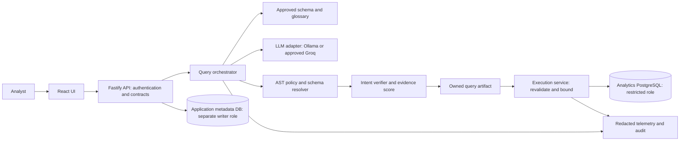

# Architecture document

## System shape

A modular monolith keeps the MVP understandable and lets one developer enforce one security pipeline. The browser holds no database credentials or provider API keys.

## Boundaries and components

- API: authentication, authorization, rate limits, body limits, contract validation and sanitized errors.
- Schema catalog: allowlisted relations/columns, keys, types, version and approved glossary. Comments and descriptions are untrusted data, never instructions.
- Intent resolver: produces metric, dimensions, filters, dates, timezone, granularity, sorting and requested row count. Missing definitions trigger clarification.
- Provider adapters: accept minimized context; output SQL, assumptions, referenced objects and explanation. Generated references are claims checked against the AST.
- Guardrails: one parsed statement; recursive default-deny AST policy; reference resolution; approved joins and function signatures; parameter/type checks; safe output bounds.
- Semantic verifier: compares resolved intent with actual AST structure and glossary definitions. Optional LLM verifier supplies additional evidence, never permission to bypass a deterministic check.
- Executor: only component with the analytics credential; reads stored SQL, validates again and enforces DB/session limits.
- Confidence service: exposes evidence and execution eligibility. No self-reported model confidence is accepted as proof.

## Generate and execute flow

1. Authenticate and validate the question. Fix relative date context using configured analytics timezone and persist the resolved period.
2. Load approved schema/glossary and authorized provider policy. Reject private-to-cloud routing.
3. Resolve intent; return a clarification if required. Generate structured output under deadline and budget.
4. Validate output shape, parse SQL and resolve all referenced objects. Reject unknown syntax or unsafe operations.
5. Normalize SQL and insert enforced row bounds without changing aggregates or requested top-N semantics. Reparse and rerun checks after any transformation.
6. Bind permitted literals as typed parameters where feasible; identifiers come only from resolved metadata. Parameterization protects literals, not arbitrary generated SQL structure.
7. Compare intent with normalized SQL. At most one regeneration is allowed for repairable failures, with the entire pipeline rerun.
8. Use non-executing EXPLAIN with server-controlled options under the restricted role and a deadline. Apply conservative cost/plan limits tuned to the fixture; estimated cost is not a correctness test. Never use EXPLAIN ANALYZE on untrusted SQL.
9. Store an immutable owned artifact with SQL hash, parameters, versions, expiry and findings. Return preview, eligibility and score.
10. On Run, check ownership, expiry and current policy/schema versions; revalidate stored SQL and plan. Stale artifacts require regeneration. The client sends an artifact ID, not SQL.
11. Start a read-only transaction using the restricted pool and fixed approved search path; set execution/lock limits. Fetch with bounded cursor/chunks so rows and bytes are capped before materializing the full result.
12. Commit or roll back, cancel on disconnect/deadline, release the pool connection, audit the outcome and return typed results. Failed cancellation requires discarding the connection.

## SQL safety policy

Support a deliberately small subset: SELECT, approved joins, aggregates, predicates, order/limit, safe subqueries and read-only CTEs. Recursive CTEs, ambiguous name resolution and unsupported AST constructs are rejected until explicitly supported.

Reject multiple statements; DDL/DML at any nesting depth; SELECT INTO; COPY; locking clauses; commands/settings; system catalogs; unapproved relations/functions; table-valued functions; dangerous extensions and resource-heavy constructs. Disallow SELECT * except approved COUNT(*) semantics. Evaluate every branch of UNION and every CTE.

The analytics role has SELECT only on approved views/tables, no owner/superuser/role-switch capability, no schema creation, no temp privilege, and no execution rights on unsafe reachable routines. Verify inherited/public privileges explicitly; do not assume SELECT is harmless. Use a dedicated analytics database with no unsafe user-defined functions where practical. Separate migration/admin credentials are unavailable to the executor.

## Hallucination and meaning checks

Schema hallucinations include invented tables/columns, invalid relationships and unresolved aliases. Semantic errors include missing filters, wrong timezone boundaries, gross/net revenue confusion, incorrect join cardinality, COUNT versus COUNT DISTINCT, duplicate aggregation, wrong grouping and reversed ranking.

Default proposed revenue glossary: sum order-item quantity × unit price for completed orders; currency is one configured currency and excludes refunds/tax unless modeled. Review the exact fixture definition in Sprint 1. Approved join paths and cardinalities guide generation and verification. The system abstains when meaning cannot be established; empty results alone are not hallucination evidence.

## Confidence and decision rules

Safety, schema validity and unresolved critical semantic findings are hard gates. Failures mean blocked/clarification irrespective of score. Database execution success does not mean the question was answered.

Proposed transparent initial score: 35% deterministic intent-slot agreement + 30% glossary/join/aggregation evidence + 20% verifier agreement + 15% stability against one independently generated candidate. Each component is scored 0–1 with evidence; an unavailable component contributes zero and is visibly marked, rather than being renormalized away. Independent agreement can repeat the same error and is only a weak signal.

Initial bands: 85–100 high; 65–84 review; below 65 abstain. High still requires explicit Run. Review requires acknowledgement and no unresolved critical mismatch. These thresholds and weights are provisional: tune on development labels and evaluate on holdout. Label the initial number “heuristic confidence,” not probability of correctness. If a later calibrated mapping is adopted, version it and publish reliability/coverage evidence.

## Proposed API contracts

| Route | Responsibility |
| --- | --- |
| GET /api/v1/schema | Approved, sanitized schema/glossary view |
| GET /api/v1/providers | Authorized provider availability; no secrets |
| POST /api/v1/queries | Question + approved provider + clarification context; returns query artifact or clarification |
| GET /api/v1/queries/:id | Owned preview, status, validation evidence |
| POST /api/v1/queries/:id/execute | Owned immutable artifact; optional review acknowledgement; idempotency key |
| GET /api/v1/executions/:id | Owned ephemeral typed results and execution status |
| GET /api/v1/executions/:id/export | Authorized bounded CSV result |
| GET /api/v1/history | Paginated owned metadata |
| POST /api/v1/queries/:id/feedback | User judgment and optional comment |
| DELETE /api/v1/history/:id | Delete owned history according to retention policy |
| GET /health/live and /health/ready | Process/dependency readiness without credential disclosure |

Query artifact fields: ID, owner, question reference, intent, provider/model, schema/glossary/prompt/policy versions, normalized SQL, typed parameters, SQL hash, status, findings, score evidence, created time and expiry (proposed 15 minutes). Execution fields: ID, artifact ID, state, columns/types, bounded rows, counts, truncation, duration and sanitized error code. Execution idempotency prevents accidental duplicate work; a deliberate rerun receives a new key.

States: received → clarification OR generating → validating → blocked/review/ready → executing → succeeded/failed/timed-out. Findings have stable codes and severities. Return meaningful HTTP status plus safe user text and request ID; never expose raw DB/provider errors.

## Data and deployment

Application entities: users/identity references, provider policies, schema versions, glossary versions, query artifacts, execution metadata, validation findings, feedback and audit events. Query text/SQL have short protected retention; audit stores hashes and reason codes. Do not persist result rows beyond the ephemeral result window.

Local topology: React dev server + Fastify + application/analytics PostgreSQL + privately reachable Ollama. Hosted topology: static frontend + backend container + private managed PostgreSQL; Groq outbound requests only when approved. A hosted local-only mode requires Ollama on a reachable private host, not the user's localhost. Browser traffic uses TLS; database and provider connectivity follow deployment-specific network controls.
